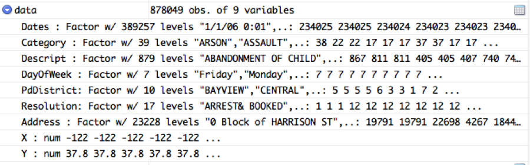
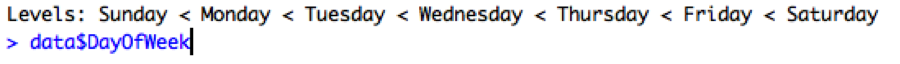
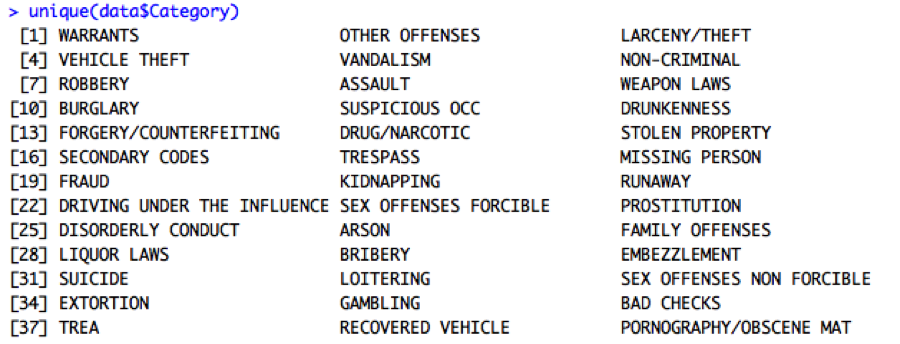
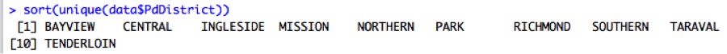
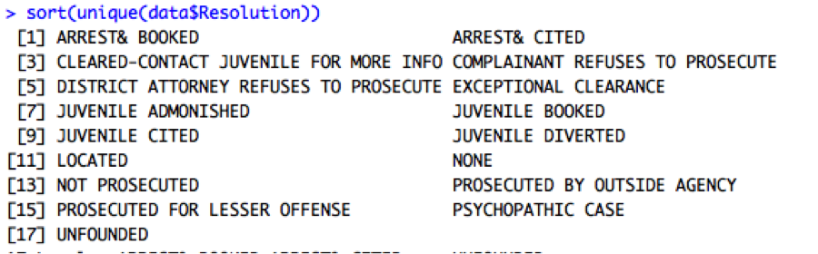
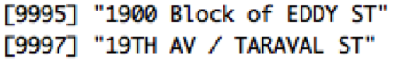
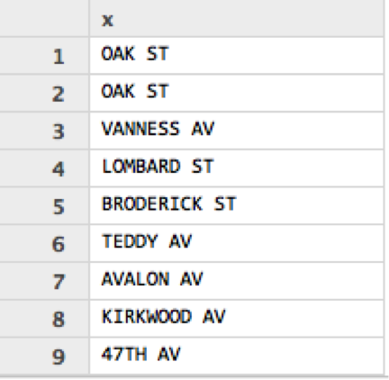

# San Francisco Crime Data (Kaggle Competition)

- - - **Work in Progress** - - -

## Summary and Objectives

## Data Acquisition

## Data Ingestion
Lets load the training data Kaggle provided:

```Rscript
data = read.csv('Kaggle/San Francisco Crime Classification/train.csv')
```

## Data Preparation

R Brought in the days of the week as a Factor, but days have an implied order (and its not alphabetical as R sets it) so lets make it ordinal: 



```Rscript
data$DayOfWeek = ordered(data$DayOfWeek, levels=c('Sunday','Monday','Tuesday','Wednesday','Thursday','Friday','Saturday'))
```




Is the data clean? 
Check for mistyping:



 
Looks like no similar categories 

We can do the same thing fro description, but to make it easier to spot similar typos we can also sort alphabetically:

```Rscript
sort(unique(data$Descript))
```

Visual inspection shows no duplicates (fuzzy near misses when they meant the same thing). Interestingly their system seems to have a broad category like “Assualt” and a number of further more specific descriptions like “ASSAULT BY POISONING”. So if we want to capture all assaults for a given region we would need to grab all instances where description starts with assault.
Every thing ok with pdDistrict:




…and with resolution:




If I want to see crime by street, address feature makes that difficult. What would be better if a StreetName feature. The address entries use one of two formats “xxx block of <street name>” and “<street name> / <other street name>”:



 
so lets extract the street name using regular expressions:

```splus

street = sub("(.+ of )(.+)","\\2",data$Address)
street = sub("(.+)( / .+)","\\1", street)

```

Which gives us our new feature of only street names:



 
Add this feature to our Data Frame: 

```splus
data$StreetName = as.factor(street)
```

See [R Documentation - Pattern Matching and Replacement](https://stat.ethz.ch/R-manual/R-devel/library/base/html/grep.html)  and [R Documentation - Regular Expressions as used in R](https://stat.ethz.ch/R-manual/R-devel/library/base/html/regex.html)  for more info on R and regular expressions.

Make sure the coordinates do not have missing values:

1. ```which(is.na(data$X))``` Result: ```integer(0)```
2. ```which(is.na(data$Y))``` Result: ```integer(0)```


## Modeling and Exploratory Analysis

## Conclusion
