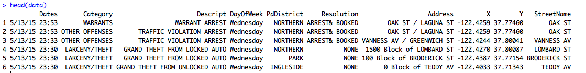
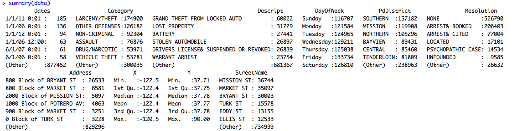

# San Francisco Crime Classification (Kaggle Competition)

**Note: This is a Work in Progress** 

## Summary and Objectives

On June 2, 2015 a Kaggle competition titled "San Francisco Crime Classification" was launched with the following objective statement:

> From 1934 to 1963, San Francisco was infamous for housing some of the world's most notorious criminals on the inescapable island of Alcatraz.

> Today, the city is known more for its tech scene than its criminal past. But, with rising wealth inequality, housing shortages, and a proliferation of expensive digital toys riding BART to work, there is no scarcity of crime in the city by the bay.

> From Sunset to SOMA, and Marina to Excelsior, this competition's dataset provides nearly 12 years of crime reports from across all of San Francisco's neighborhoods. Given time and location, you must predict the category of crime that occurred.

This competition was interesting to me not just because of my proximity to San Francisco, or because I have had close friends victimized in the city, but also because it was an opportunity to use data science for the public good. 

Can we do analysis on this data that reveals trends in crime that were previously unknown? 

## Data Acquisition

The data is provided on the [Kaggle competition website](https://www.kaggle.com/c/sf-crime/data). 

You will need to download at least the test.csv and train.csv files. These files are compressed in zip archives. To use the same paths I will in this report, extract the files to your "~/Kaggle/San Francisco Crime Classification" directory.

## Data Ingestion
Lets load the training data Kaggle provided by using the built-in Comma Separated Values (CSV) reader function:

```R
data = read.csv('Kaggle/San Francisco Crime Classification/train.csv')
```

This read.csv function automatically handles special cases found in this dataset such as a comma as part of a variable's contents not intended as a value separator.

We can get a first-look at the values in the dataset by using the R head function,```R head(data) ```:



## Data Preparation

### Factor vs Ordinal

R Brought in the days of the week as a Factor. 


The fact is that whether you think the week starts on Sunday or Monday, the set of days do have an implied order (and its not alphabetical as R sets it). To properly handle this variable with any algorithm that can make use of the order, lets convert this column to ordinal with Sunday as the first day of the week. 

```R
data$DayOfWeek = ordered(data$DayOfWeek, levels=c('Sunday','Monday','Tuesday','Wednesday','Thursday','Friday','Saturday'))
```

R now shows us this variable as ordinal


.. and we can see that DayOfWeek follows the order we specified:


### Making the best use of a variable

If I want to see crime by street, the Address variable makes that difficult. What would be better is a StreetName feature. The address entries use one of two formats “xxx block of <street name>” and “<street name> / <other street name>” as seen in these two sample observations:


 
so lets extract the street name using regular expressions:

```R
street = sub("(.+ of )(.+)","\\2",data$Address)
street = sub("(.+)( / .+)","\\1", street)
```

Which gives us our new feature of only street names:


 
Add this feature to our Data Frame: 

```R
data$StreetName = as.factor(street)
```

See [R Documentation - Pattern Matching and Replacement](https://stat.ethz.ch/R-manual/R-devel/library/base/html/grep.html)  and [R Documentation - Regular Expressions as used in R](https://stat.ethz.ch/R-manual/R-devel/library/base/html/regex.html)  for more info on R and regular expressions.

## Data Exploration

### Summary Statistics

Using the ```summary()``` function in R, we can get counts of unique values for Factor/Ordinal variables, and summary statistics for numerical variables:


### Is the data clean? 

Check for categories that are supposed to be the same, but due to a human mistyping have resulted in multiple categories:


 
...Looks like the Category variable has no data entry errors.

We can do the same thing for the Description variable, but to make it easier to spot similar typos we can also sort alphabetically:

```R
sort(unique(data$Descript))
```

Visual inspection shows no duplicates (fuzzy near misses when they meant the same thing). Interestingly their system seems to have a broad category like “Assualt” and a number of further more specific descriptions like “ASSAULT BY POISONING”. So if we want to capture all assaults for a given region we would need to grab all instances where description starts with assault.

Every thing ok with pdDistrict:


…and with resolution:


Make sure the coordinates do not have missing values:

1. ```which(is.na(data$X))``` Result: ```integer(0)```
2. ```which(is.na(data$Y))``` Result: ```integer(0)```


## Building a Crime Classification Model

### Random Forest Model
The Random Forest algorithm builds an ensemble of weak learners (Decision trees that do not classify well), who all vote on the correct classification for a new instance. This ensemble technique has many advantages over a single decision tree including:

* Advantage 1
* Advantage 2

We will use the R package [randomForest](https://cran.r-project.org/web/packages/randomForest/randomForest.pdf) to build and validate our crime classification model.
## Conclusion
