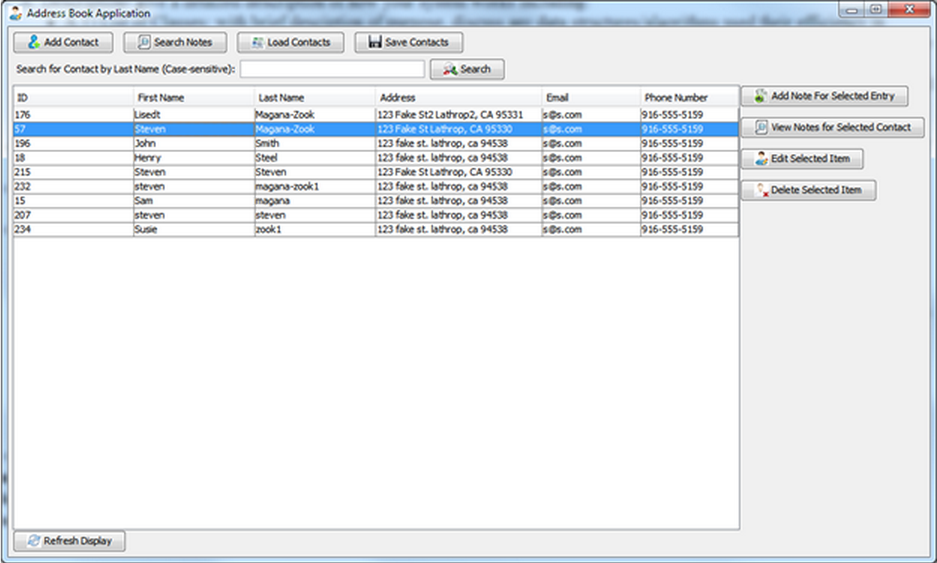
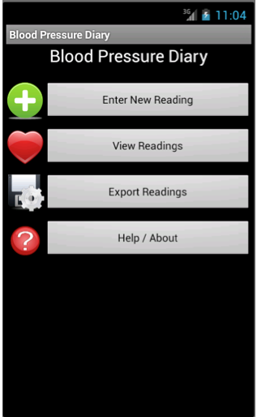

## Open Source Contributions
* Issues Reported
  * [Storm-457: Unable to kill topologies whose name has spaces](https://issues.apache.org/jira/browse/STORM-457) 
  * [Storm-456: Unable to kill topologies whose name has spaces](https://issues.apache.org/jira/browse/STORM-456)
* Patches Submitted
  * [PIG-4636: Occurred spelled incorrectly in error message for Launcher and POMergeCogroup](https://issues.apache.org/jira/browse/PIG-4636)

## Presentations

### Random Forest Use in Predicting Cancer
** Download: ** [Presentation](non-images/MAGANA-ZOOK_Random ForestsAndTheirApplicationToCancerPrediction.pdf) 
    
** Overview: ** This presentation introduces viewers to what random forests are, how machine learning has played a historic role in the medical field, and how random forests are becoming the preferred solution for classifying samples as cancerous or benign over black-box techniques like neural networks.
 

<h2>
Data Science Projects
</h2>
<h3>Project Ideas</h3>

<ul>
<li>R</li>
<li>Python (matplotlib, scikit-learn, etc.)</li>
<li>SQL</li>
<li>Tableau</li>
<li>ML Algorithms: Random Forests, Logistic Regression, SVM, Naive Bayes for document classification, LDA for topic analysis, Recommendation engine (spark based?), K-means or something more interesting for unsupervised, a streaming online learning algorithm (use spark streaming + KAFKA)</li>
</ul>

<h2>
Desktop Application Projects
</h2>
<h3>Contact Book</h3>

<b>Technologies Used:</b> Java (Swing, JDBC)
 
<b>Code Repository:</b> <a href="https://github.com/stevenmz/DatabaseContactBook">GitHub</a>
 
<b>Overview:</b> This application manages an JDBC-based database persisted contact book using a graphical use interface. Features of this application include: adding / editing / deleting contacts from a database, adding / viewing / deleting notes on a contact, searching for contacts, and searching for notes.

<h2>
Android Application Projects
</h2>
<h3>Blood Pressure Diary</h3>

<b>Technologies Used:</b> Java (Android SDK), RoboGuice (dependency injection framework)
 
<b>Code Repository:</b> <a href="https://github.com/stevenmz/BloodPressureDiary">GitHub</a>
 
<b>Overview:</b> This application was written to make it easy for people who need to track their blood pressure to do so from anywhere using their smartphone. Features of this application include: adding blood pressure readings, viewing readings in list or graph form, export of readings for sending to a health provider, and a help section that provides information on blood pressure ranges from a trusted medical source (Mayo Clinic).

</section>
